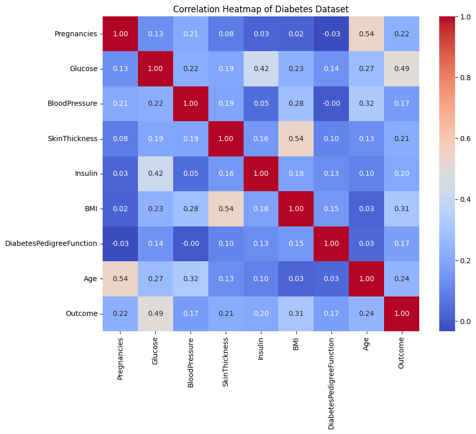
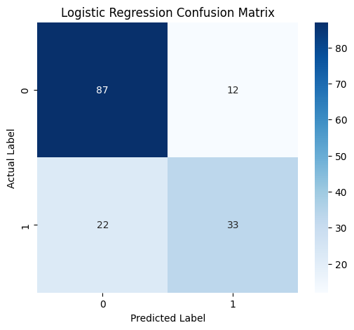
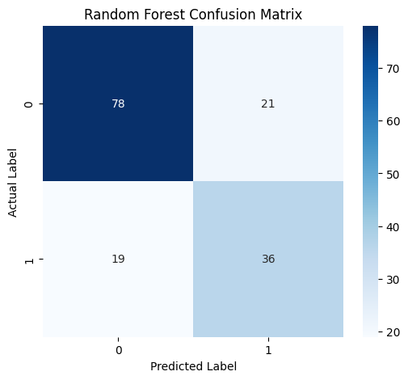

# Disease Prediction Using Patient Data

## Project Overview
This project focuses on building a predictive model to diagnose diabetes using patient data from the Pima Indians Diabetes Dataset. The workflow includes essential steps in a machine learning pipeline: data cleaning and preprocessing, exploratory data analysis (EDA), and training two classification models to predict disease onset.

## Key Findings
- **Data Preprocessing:** Handled missing values (represented by zeros) in columns like `Glucose` and `BMI` by replacing them with the median. All numerical features were then scaled to a consistent range using MinMaxScaler.
- **Model Performance:** Two models were trained and evaluated:
    - **Logistic Regression:** Achieved an accuracy of 0.78, with fewer false negatives and false positives.
    - **Random Forest:** Achieved an accuracy of 0.74.
- **Conclusion:** Based on its higher overall accuracy and better performance on critical metrics from the confusion matrix, the **Logistic Regression** model was the preferred choice for this classification task.

## Visualizations
The following plots were generated to gain insights and evaluate model performance:

### Correlation Heatmap
This heatmap visualizes the linear relationships between all variables in the dataset. It showed that `Glucose` has the strongest positive correlation with the `Outcome` (diabetes diagnosis).

### Model Confusion Matrices
These matrices provide a detailed breakdown of the true positive, false positive, true negative, and false negative predictions for each model.

#### Logistic Regression Confusion Matrix

#### Random Forest Confusion Matrix

## Tools & Technologies
The project was developed using Python and the following libraries:
- `pandas` for data manipulation.
- `numpy` for numerical operations.
- `scikit-learn` for machine learning models and metrics.
- `matplotlib` and `seaborn` for data visualization.

## Data Source
The dataset used in this project is the [Pima Indians Diabetes Database](https://www.kaggle.com/datasets/uciml/pima-indians-diabetes-database), originally from the UCI Machine Learning Repository.
